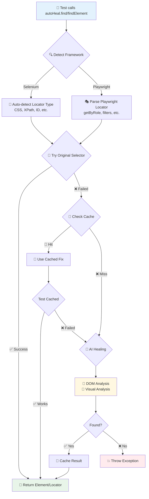

# 🤖 AutoHeal Locator

[](https://github.com/SanjayPG/autoheal-locator/releases)
[](https://github.com/SanjayPG/autoheal-locator/actions)
[](https://opensource.org/licenses/MIT)
[](https://adoptium.net/)
[](https://www.selenium.dev/)
[](https://playwright.dev/java/)

**AI-powered test automation framework that automatically heals broken locators for both Selenium and Playwright.** When your element locators break due to UI changes, AutoHeal intelligently finds the elements using DOM analysis, visual recognition, and smart fallback strategies.

---

## 🎯 Choose Your Framework

<table>
<tr>
<td width="50%" valign="top">

### 🟢 Selenium
Traditional WebDriver-based automation
- ✅ All locator types (CSS, XPath, ID, etc.)
- ✅ Java-first API
- ✅ Mature ecosystem
- ✅ Wide browser support

**[📖 Selenium Quick Start](#-selenium-quick-start)**

</td>
<td width="50%" valign="top">

### 🔵 Playwright
Modern automation framework
- ✅ Built-in auto-waiting
- ✅ Native network interception
- ✅ Multi-browser contexts
- ✅ Powerful selectors with filters

**[📖 Playwright Quick Start](#-playwright-quick-start)**

</td>
</tr>
</table>

---

## 🚀 Why AutoHeal?

Traditional test automation fails when developers change the UI. AutoHeal solves this by:

- **🔍 Intelligent Element Detection**: Uses AI to find elements with DOM analysis and visual recognition
- **🎭 Dual Framework Support**: Works seamlessly with both Selenium and Playwright
- **🎯 Framework-Aware Healing**: Understands Selenium By locators and Playwright semantic locators
- **🧠 Multiple AI Providers**: Google Gemini, OpenAI, Anthropic Claude, DeepSeek, Grok, and Local Models
- **🔄 Smart Healing Strategies**: DOM analysis, visual analysis, hybrid, and cached approaches
- **⚡ High-Performance Caching**: Remembers successful fixes to avoid repeated AI calls
- **📊 Comprehensive Reporting**: Detailed insights into healing activities and costs
- **🔄 Drop-in Integration**: Minimal code changes required

### 🔄 How AutoHeal Works



---

## 📦 Installation

Add this to your `pom.xml`:

```xml
<dependency>
  <groupId>com.headout</groupId>
  <artifactId>autoheal-locator</artifactId>
  <version>1.0.0</version>
</dependency>
```

> **📝 Note**: For detailed installation methods (GitHub Packages, JAR download, build from source), see the [Installation Guide](#-installation-methods) below.

---

## 🟢 Selenium Quick Start

### 1. Set Your AI API Key

```bash
# Windows
set GEMINI_API_KEY=your-api-key-here

# Mac/Linux
export GEMINI_API_KEY=your-api-key-here
```

> **🔑 Get API Key**: Visit https://makersuite.google.com/app/apikey

### 2. Replace Your WebDriver Code

**Before AutoHeal:**
```java
WebDriver driver = new ChromeDriver();
WebElement button = driver.findElement(By.id("submit-btn"));
button.click();
```

**After AutoHeal:**
```java
WebDriver driver = new ChromeDriver();
AutoHealLocator autoHeal = AutoHealManager.createSeleniumAutoHeal(driver);

// AutoHeal auto-detects locator type and heals if needed
WebElement button = autoHeal.findElement("submit-btn", "Submit button"); // ID
// OR WebElement button = autoHeal.findElement("#submit-btn", "Submit button"); // CSS
// OR WebElement button = autoHeal.findElement("//button[@id='submit-btn']", "Submit button"); // XPath

button.click();
```

### 3. Selenium Usage Examples

```java
// AutoHeal auto-detects all Selenium locator types
WebElement elem1 = autoHeal.findElement("username", "Username field");           // ID
WebElement elem2 = autoHeal.findElement("#username", "Username field");         // CSS
WebElement elem3 = autoHeal.findElement("//input[@name='username']", "Username field"); // XPath
WebElement elem4 = autoHeal.findElement("btn-primary", "Submit button");        // Class Name

// Multiple elements
List<WebElement> items = autoHeal.findElements(".product-item", "Product items");

// With explicit wait
WebElement element = autoHeal.waitForElement("#dynamic-content", "Dynamic content", 10);
```

**[📖 Full Selenium Documentation](docs/selenium-usage-guide.md)**

---

## 🔵 Playwright Quick Start

### 1. Set Your AI API Key

```bash
# Windows
set GEMINI_API_KEY=your-api-key-here

# Mac/Linux
export GEMINI_API_KEY=your-api-key-here
```

> **🔑 Get API Key**: Visit https://makersuite.google.com/app/apikey

### 2. Zero-Rewrite Migration

AutoHeal supports native Playwright locators with **ZERO code changes**!

**Before AutoHeal:**
```java
Page page = browser.newPage();
Locator button = page.getByRole(AriaRole.BUTTON, new Page.GetByRoleOptions().setName("Submit"));
button.click();
```

**After AutoHeal (Method 1 - Native Locators):**
```java
Page page = browser.newPage();
AutoHealLocator autoHeal = AutoHealManager.createPlaywrightAutoHeal(page);

// Use native Playwright locators directly - AutoHeal wraps them automatically!
Locator button = autoHeal.find(page,
    page.getByRole(AriaRole.BUTTON, new Page.GetByRoleOptions().setName("Submit")),
    "Submit button");
button.click();
```

**After AutoHeal (Method 2 - String Format):**
```java
Page page = browser.newPage();
AutoHealLocator autoHeal = AutoHealManager.createPlaywrightAutoHeal(page);

// Or use JavaScript-style strings
Locator button = autoHeal.find(page,
    "getByRole('button', { name: 'Submit' })",
    "Submit button");
button.click();
```

### 3. Playwright Usage Examples

#### Semantic Locators
```java
// All Playwright locator types supported
Locator elem1 = autoHeal.find(page, page.getByRole(AriaRole.TEXTBOX,
    new Page.GetByRoleOptions().setName("Username")), "Username field");

Locator elem2 = autoHeal.find(page, page.getByPlaceholder("Email"), "Email field");

Locator elem3 = autoHeal.find(page, page.getByText("Welcome"), "Welcome message");

Locator elem4 = autoHeal.find(page, page.getByTestId("submit-btn"), "Submit button");
```

#### Filtered Locators (Advanced)
```java
// AutoHeal fully supports Playwright filters!
Locator product = autoHeal.find(page,
    page.getByRole(AriaRole.LISTITEM)
        .filter(new Locator.FilterOptions().setHasText("Product 1"))
        .getByRole(AriaRole.BUTTON),
    "Product 1 Add to cart button");

// Filter with regex
Locator item = autoHeal.find(page,
    page.getByRole(AriaRole.LISTITEM)
        .filter(new Locator.FilterOptions().setHasText(Pattern.compile("Product"))),
    "Product item");

// Multiple filters
Locator elem = autoHeal.find(page,
    page.getByRole(AriaRole.LISTITEM)
        .filter(new Locator.FilterOptions().setHasText("In stock"))
        .filter(new Locator.FilterOptions().setHasNotText("Out of stock")),
    "In stock item");
```

#### String-Based Locators
```java
// JavaScript-style string format
Locator elem1 = autoHeal.find(page, "getByRole('button', { name: 'Login' })", "Login button");
Locator elem2 = autoHeal.find(page, "getByPlaceholder('Username')", "Username field");
Locator elem3 = autoHeal.find(page, "getByText('Welcome')", "Welcome text");

// CSS selectors and XPath also supported
Locator elem4 = autoHeal.find(page, "#submit-btn", "Submit button");
Locator elem5 = autoHeal.find(page, "//button[@id='submit']", "Submit button");
```

**[📖 Full Playwright Documentation](docs/PLAYWRIGHT_GUIDE.md)**

---

## 🔧 Configuration

Create `src/test/resources/autoheal.properties`:

```properties
# AI Configuration
autoheal.ai.provider=GOOGLE_GEMINI
autoheal.ai.api-key=${GEMINI_API_KEY}
autoheal.ai.model=gemini-2.0-flash
autoheal.ai.timeout=30s
autoheal.ai.visual-analysis-enabled=true

# Cache Configuration
autoheal.cache.type=PERSISTENT_FILE
autoheal.cache.maximum-size=10000
autoheal.cache.expire-after-write=24h

# Playwright-Specific (optional)
autoheal.playwright.healing-strategy=SMART_SEQUENTIAL
autoheal.playwright.enable-filters=true

# Selenium-Specific (optional)
autoheal.selenium.implicit-wait=10s
autoheal.selenium.explicit-wait=30s

# Performance
autoheal.performance.thread-pool-size=4
autoheal.performance.enable-metrics=true

# Reporting
autoheal.reporting.enabled=true
autoheal.reporting.generate-html=true
autoheal.reporting.output-directory=target/autoheal-reports
```

---

## 🎛️ Framework Comparison

| Feature | Selenium | Playwright |
|---------|----------|------------|
| **Locator Types** | CSS, XPath, ID, Name, Class, Tag, Link Text | getByRole, getByText, getByPlaceholder, CSS, XPath |
| **AutoHeal Support** | ✅ Full | ✅ Full |
| **Filter Support** | ❌ N/A | ✅ hasText, hasNotText, has, hasNot |
| **Native Objects** | `WebElement` | `Locator` |
| **Zero-Rewrite** | ❌ Requires wrapper | ✅ Native locators work directly |
| **Visual Analysis** | ✅ Supported | ✅ Supported |
| **DOM Analysis** | ✅ Supported | ✅ Framework-aware |
| **Caching** | ✅ Unified cache | ✅ Unified cache |

---

## 🔄 How AutoHeal Works


---

## 🎯 Supported Features by Framework

### Selenium Features
- ✅ All locator types: CSS, XPath, ID, Name, Class, Tag, Link Text, Partial Link Text
- ✅ Auto-detection of locator type
- ✅ `WebElement` return type
- ✅ `findElement()` and `findElements()`
- ✅ Explicit waits with timeout
- ✅ Page Object Model support
- ✅ DOM and Visual healing

### Playwright Features
- ✅ All semantic locators: getByRole, getByText, getByPlaceholder, getByLabel, getByAltText, getByTitle, getByTestId
- ✅ Filter support: hasText, hasNotText (with string and regex)
- ✅ Partial filter support: has, hasNot (nested locators)
- ✅ CSS selectors and XPath
- ✅ Native `Locator` return type
- ✅ Zero-rewrite migration (use native Playwright objects)
- ✅ JavaScript-style string format
- ✅ DOM and Visual healing
- ✅ Framework-aware AI prompts

---

## 🎛️ AI Providers

| Provider | Default Model | API Key Env Var | Cost | Speed |
|----------|---------------|-----------------|------|-------|
| **Google Gemini** | `gemini-2.0-flash` | `GEMINI_API_KEY` | 💰 Low | ⚡ Fast |
| **OpenAI** | `gpt-4o-mini` | `OPENAI_API_KEY` | 💰💰 Medium | ⚡ Fast |
| **Anthropic Claude** | `claude-3-sonnet` | `ANTHROPIC_API_KEY` | 💰💰 Medium | ⚡ Medium |
| **DeepSeek** | `deepseek-chat` | `DEEPSEEK_API_KEY` | 💰 Low | ⚡ Fast |
| **Grok** | `grok-beta` | `GROK_API_KEY` | 💰💰 Medium | ⚡ Fast |
| **Local Models** | `llama3.2:3b` | None | 💰 Free | ⚡ Varies |

**Get API Keys:**
- Google Gemini: https://makersuite.google.com/app/apikey
- OpenAI: https://platform.openai.com/api-keys
- Anthropic: https://console.anthropic.com/
- DeepSeek: https://platform.deepseek.com/
- Grok: https://console.x.ai/

---

## 📊 Reporting

AutoHeal generates comprehensive reports for both frameworks:

### HTML Report
```
target/autoheal-reports/
├── AutoHeal-Report-20240101-120000.html
├── AutoHeal-Report-20240101-120000.json
└── summary.json
```

### Sample Report
```
🤖 AutoHeal Execution Summary
═══════════════════════════════════
Framework: Playwright (or Selenium)
✅ Elements Found: 15
🔧 Healing Events: 3
💰 Total Cost: $0.06
⚡ Cache Hit Rate: 78%
🕒 Average Response Time: 1.2s
```

---

## 📦 Installation Methods

### Method 1: Maven Central (Recommended)

```xml
<dependency>
  <groupId>io.github.sanjaypg</groupId>
  <artifactId>autoheal-locator</artifactId>
  <version>1.0.5</version>
</dependency>
```

### Method 2: Build from Source

```bash
git clone https://github.com/SanjayPG/autoheal-locator.git
cd autoheal-locator
mvn clean install -DskipTests
```

Then use in your project:
```xml
<dependency>
  <groupId>com.headout</groupId>
  <artifactId>autoheal-locator</artifactId>
  <version></version>1.0.0</version>
</dependency>
```

---

## 📚 Documentation

- **📖 Selenium Guide**: [selenium-usage-guide.md](docs/selenium-usage-guide.md)
- **📖 Playwright Guide**: [PLAYWRIGHT_GUIDE.md](docs/PLAYWRIGHT_GUIDE.md)
- **🔧 Advanced Configuration**: [extended-documentation.md](docs/extended-documentation.md)
- **🔧 Configuration Examples**: [CONFIGURATION_EXAMPLES.md](docs/CONFIGURATION_EXAMPLES.md)
- **🎯 Filter Support Status**: [FILTER_SUPPORT_STATUS.md](docs/FILTER_SUPPORT_STATUS.md)
- **🐛 OpenAI Debug Guide**: [OPENAI_DEBUG_GUIDE.md](docs/OPENAI_DEBUG_GUIDE.md)
- **📚 Getting Started Guide**: [GETTING-STARTED-GUIDE.md](docs/GETTING-STARTED-GUIDE.md)
- **🎯 Examples**: Check the `src/test/java` directory

---

## 🐛 Troubleshooting

### Common Issues

**❌ API Key Not Found**
```bash
export GEMINI_API_KEY=your-actual-api-key
echo $GEMINI_API_KEY  # Verify it's set
```

**❌ Element Still Not Found**
```properties
autoheal.advanced.debug-mode=true
autoheal.advanced.save-screenshots=true
```

**❌ Playwright Filter Not Working**

Check that you're using the latest version (1.0.5+) which includes full filter support.

---

## 🤝 Contributing

We welcome contributions! Please:

1. Fork the repository
2. Create a feature branch
3. Add tests for both Selenium and Playwright
4. Submit a pull request

---

## 📄 License

MIT License - see [LICENSE](LICENSE) file for details.

---

## 🙋‍♂️ Support

- **🐛 Bug Reports**: [GitHub Issues](https://github.com/SanjayPG/autoheal-locator/issues)
- **💡 Feature Requests**: [GitHub Discussions](https://github.com/SanjayPG/autoheal-locator/discussions)

---

<div align="center">

**Made with ❤️ for the Test Automation Community**

**Supporting Both Selenium & Playwright** 🟢🔵

[⬆ Back to Top](#-autoheal-locator)

</div>
